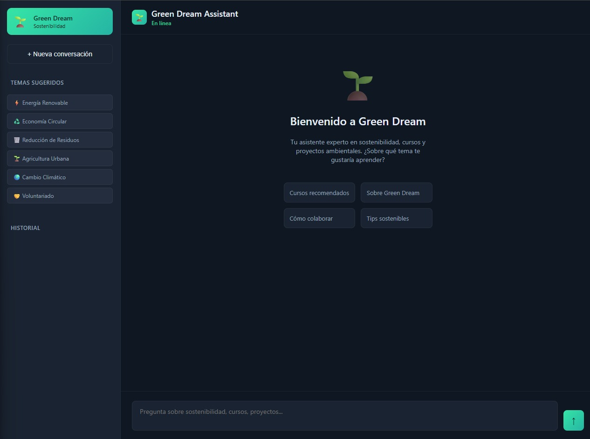

# 🌱 Green Dream RAG Assistant

Backend y Chat Asistido por RAG para la ONG Green Dream

Este proyecto implementa un **asistente conversacional inteligente** que combina:

- **RAG (Retrieval-Augmented Generation)** con una base de conocimiento local.
- **Modelos de Azure AI Foundry** (por ejemplo: GPT-4o-mini o Azure Copilot).

El objetivo es permitir a la ONG Green Dream integrar un asistente en su página web que pueda:

- Responder preguntas generales como ChatGPT.
- Recomendar cursos oficiales de Green Dream.
- Apoyar actividades de sostenibilidad.
- Funcionar como API para ser usado en cualquier chat embebido.

---

# ⭐ Antes de comenzar: Crear el modelo en Azure AI Foundry

Para que este proyecto funcione, debes crear un **proyecto y un modelo** en Azure AI Foundry y obtener:

```sh
AZURE_AI_ENDPOINT5
AZURE_AI_KEY
```

## 1. Crear cuenta en Azure

1. Ir a: <https://azure.microsoft.com>
2. Registrarse (puedes usar una cuenta gratuita).

## 2. Crear un Hub en Azure AI Foundry

1. Entrar a: <https://ai.azure.com>
2. Clic en **Create Hub**.
3. Configurar:
   - Resource group: crear `green-dream-rg`.
   - Region: la más cercana (East US, Brazil South, West US 2).
   - Hub name: `green-dream-hub`.

## 3. Crear un Proyecto dentro del Hub

- Dentro del hub → **Create Project**.
- Nombre sugerido: `green-dream-rag-project`.

## 4. Crear el modelo de lenguaje (Deployment)

1. Ir a **Model Catalog**.
2. Buscar: **GPT-4o-mini** o **Azure OpenAI GPT-4o**.
3. Clic en **Deploy**.
4. Nombre: `gd-assistant`.
5. Tipo: **Serverless API**.

## 5. Obtener las credenciales

1. En tu Proyecto → **Settings → Keys**.
2. Copiar:

```sh
AZURE_AI_ENDPOINT=https://<tu-endpoint>.openai.azure.com/
AZURE_AI_KEY=<tu-clave>
```

Colocarlas en `config/.env`.

⚠ _Nunca subas este archivo al repositorio._

---

# 📂 Estructura del Proyecto

```sh
repo-root/
├── src/
│   ├── api_complete.py     # API Flask
│   ├── assistant_rag.py    # Lógica del asistente + RAG
│   ├── chat_client.py      # Cliente de Azure AI Foundry
│   └── rag_system.py       # Sistema de recuperación de información
├── knowledge_base/         # Base de conocimiento interna
├── config/
│   ├── .env                # Credenciales (NO subir)
│   └── .env.example        # Plantilla
├── scripts/
│   ├── start.ps1           # Arranque fácil en Windows
│   └── stop.ps1            # Detiene servicios
├── website.html            # Chat estilo ChatGPT
├── docker-compose.yml
├── Dockerfile
└── README.md
```

---

# 🎯 Dos formas de usar el proyecto

## 1️⃣ Como **API Backend RAG** (uso principal)

Sirve para integrarlo en cualquier chat embebido en la web de Green Dream.

**Endpoint principal:**

```sh
POST http://localhost:5001/api/chat
```

Entrega respuestas usando RAG + Azure.

## 2️⃣ Como **Chat estilo ChatGPT** (modo demostración)



Simplemente abrir:

```sh
website.html
```

Este chat:

- Responde preguntas generales como ChatGPT.
- Recomienda cursos de la ONG.
- Fomenta actividades de sostenibilidad.

---

# 🔧 Configuración Inicial

## 0️⃣ Clonar el repositorio (paso previo)

Antes de hacer cualquier otra cosa, clona el repo y muévete a la carpeta del proyecto:

```bash
git clone https://github.com/gianmarco-holm/Proyecto02-SDK-Foundry-ONG-GD-v2.git
cd Proyecto02-SDK-Foundry-ONG-GD-v2
```

Puedes confirmar que estás en la carpeta correcta viendo que exista la estructura con `src/`, `config/`, `docker-compose.yml`, etc.

# 🔧 Configuración Inicial

## Copiar variables de entorno

```sh
Copy-Item config/.env.example config/.env
```

Actualizar con tus credenciales.

---

# 🚀 Formas de desplegar el sistema

El proyecto puede ejecutarse de **tres formas**.

---

# 🟩 1. Método fácil (Windows) — usando `start.ps1`

Ejecutar:

```sh
./scripts/start.ps1
```

Para reconstruir:

```sh
./scripts/start.ps1 -Rebuild
```

Para detener:

```sh
./scripts/stop.ps1
```

---

# 🟦 2. Despliegue manual con Docker Compose

```sh
docker compose build --no-cache
docker compose up -d
```

Ver logs:

```sh
docker compose logs -f api
```

Health check:

```sh
http://localhost:5001/api/health
```

---

# 🟧 3. Ejecución local sin Docker (modo desarrollador)

```sh
python -m venv .venv
./.venv/Scripts/activate
pip install -r requirements.txt
python src/api_complete.py
```

---

# 📡 Ejemplo de uso de la API

```python
import requests

resp = requests.post(
    "http://localhost:5001/api/chat",
    json={"message": "¿Qué cursos recomiendas sobre energías renovables?"}
)

print(resp.json()["response"])
```

---

# 🧪 Notebook de prueba

Ubicado en:

```sh
notebooks/test_api.ipynb
```

Permite:

- Probar `/api/health`.
- Enviar mensajes a `/api/chat`.
- Detectar automáticamente `localhost` o `host.docker.internal`.

---

# 🤝 Contribuir

1. Crear nueva rama.
2. Realizar cambios.
3. Enviar PR.
4. No incluir credenciales.

---

# 🛡 Licencia

Proyecto desarrollado para la ONG Green Dream.
Uso autorizado con fines educativos y de sostenibilidad.
